# Spec Pipeline Workflow - Documentacao Completa

> **Versao:** 1.0
> **Criado:** 2026-01-28
> **Autor:** @architect (Aria)
> **Epic:** Epic 3 - Spec Pipeline
> **Status:** Ativo

---

## 1. Visao Geral

O **Spec Pipeline** e um workflow orquestrado que transforma requisitos informais em especificacoes executaveis. Ele e parte da infraestrutura **Auto-Claude ADE** (Autonomous Development Engine) e implementa um fluxo de 5 fases principais que se adaptam dinamicamente baseado na complexidade do requisito.

### 1.1 Proposito

- Transformar descricoes informais de usuarios em especificacoes formais e estruturadas
- Garantir qualidade e consistencia atraves de gates de validacao
- Adaptar o nivel de profundidade baseado na complexidade detectada
- Produzir artefatos rastreavies desde requisitos ate implementacao

### 1.2 Principios Fundamentais

| Principio | Descricao |
|-----------|-----------|
| **No Invention** | Nenhuma informacao inventada - apenas derivacao dos inputs |
| **Traceability** | Todo statement deve rastrear para um requisito ou pesquisa |
| **Adaptive Phases** | Fases ajustadas automaticamente pela complexidade |
| **Quality Gates** | Validacao obrigatoria antes de avancar |

---

## 2. Diagrama do Workflow

### 2.1 Fluxo Principal

```mermaid
flowchart TB
    subgraph TRIGGER["Gatilhos"]
        T1["*create-spec STORY-ID"]
        T2["story_created<br/>(autoSpec.enabled)"]
    end

    subgraph PREFLIGHT["Pre-Flight Checks"]
        PF1["story_exists<br/>Verificar/criar diretorio"]
        PF2["no_existing_spec<br/>Evitar sobrescrita"]
        PF3["agents_available<br/>Verificar configuracao"]
    end

    subgraph PHASE1["Fase 1: Gather Requirements"]
        direction TB
        G1["@pm (Morgan)"]
        G2["Elicitacao Interativa<br/>9 categorias de perguntas"]
        G3["requirements.json"]
        G1 --> G2 --> G3
    end

    subgraph PHASE2["Fase 2: Assess Complexity"]
        direction TB
        A1["@architect (Aria)"]
        A2["Avaliar 5 dimensoes:<br/>Scope, Integration, Infra,<br/>Knowledge, Risk"]
        A3["complexity.json<br/>SIMPLE | STANDARD | COMPLEX"]
        A1 --> A2 --> A3
    end

    subgraph PHASE3["Fase 3: Research Dependencies"]
        direction TB
        R1["@analyst (Atlas)"]
        R2["Context7 + EXA<br/>Validar dependencias"]
        R3["research.json"]
        R1 --> R2 --> R3
    end

    subgraph PHASE4["Fase 4: Write Specification"]
        direction TB
        W1["@pm (Morgan)"]
        W2["Gerar spec.md<br/>Sem invencao"]
        W3["spec.md"]
        W1 --> W2 --> W3
    end

    subgraph PHASE5["Fase 5: Critique Specification"]
        direction TB
        C1["@qa (Quinn)"]
        C2["Avaliar 5 dimensoes:<br/>Accuracy, Completeness,<br/>Consistency, Feasibility,<br/>Alignment"]
        C3{"Verdict"}
        C4["APPROVED"]
        C5["NEEDS_REVISION"]
        C6["BLOCKED"]
        C1 --> C2 --> C3
        C3 --> C4
        C3 --> C5
        C3 --> C6
    end

    subgraph PHASE5B["Fase 5b: Revise (COMPLEX)"]
        REV1["@pm (Morgan)"]
        REV2["Aplicar feedback<br/>e auto-fixes"]
    end

    subgraph PHASE6["Fase 6: Create Plan"]
        direction TB
        P1["@architect (Aria)"]
        P2["Gerar implementation.yaml<br/>Subtasks atomicas"]
        P3["plan.json"]
        P1 --> P2 --> P3
    end

    subgraph COMPLETION["Conclusao"]
        DONE["Pipeline Complete"]
        ARTIFACTS["Artefatos Gerados"]
    end

    T1 --> PREFLIGHT
    T2 --> PREFLIGHT
    PREFLIGHT --> PHASE1
    PHASE1 --> PHASE2
    PHASE2 --> PHASE3
    PHASE3 --> PHASE4
    PHASE4 --> PHASE5
    C4 --> PHASE6
    C5 --> PHASE5B
    PHASE5B --> PHASE5
    C6 -.-> |"Escalar para @architect"| HALT["HALT"]
    PHASE6 --> COMPLETION

    style TRIGGER fill:#e1f5fe
    style PREFLIGHT fill:#fff3e0
    style PHASE1 fill:#e8f5e9
    style PHASE2 fill:#fce4ec
    style PHASE3 fill:#f3e5f5
    style PHASE4 fill:#e8f5e9
    style PHASE5 fill:#fff8e1
    style PHASE5B fill:#ffebee
    style PHASE6 fill:#e0f2f1
    style COMPLETION fill:#c8e6c9
```

### 2.2 Fluxo por Complexidade

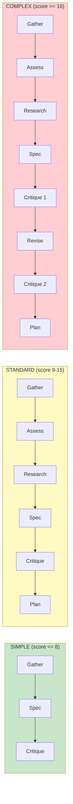

### 2.3 Diagrama de Sequencia

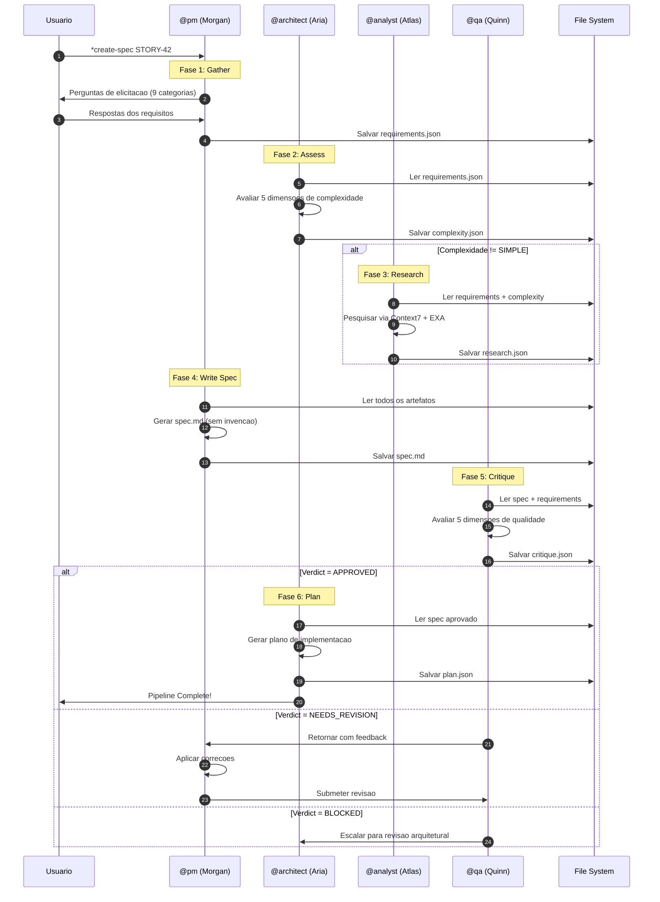

---

## 3. Steps Detalhados

### 3.1 Fase 1: Gather Requirements

| Atributo | Valor |
|----------|-------|
| **Step ID** | `gather` |
| **Phase Number** | 1 |
| **Agente** | @pm (Morgan) |
| **Task** | `spec-gather-requirements.md` |
| **Elicit** | Sim - requer interacao do usuario |

#### Inputs

| Input | Tipo | Obrigatorio | Descricao |
|-------|------|-------------|-----------|
| `storyId` | string | Sim | ID da story sendo especificada |
| `source` | enum | Nao | Fonte: `prd`, `user`, `existing` |
| `prdPath` | string | Nao | Caminho para PRD se source=prd |

#### Outputs

| Output | Localizacao |
|--------|-------------|
| `requirements.json` | `docs/stories/{storyId}/spec/requirements.json` |

#### Processo de Elicitacao (9 Categorias)

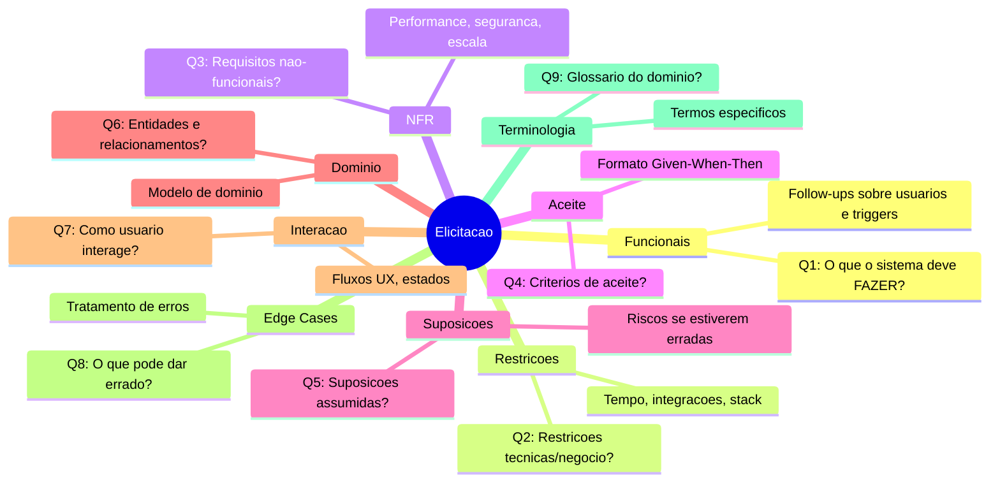

#### Estrutura do Output (requirements.json)

```json
{
  "storyId": "STORY-42",
  "gatheredAt": "2026-01-28T10:00:00Z",
  "source": "user",
  "gatheredBy": "@pm",
  "elicitationVersion": "2.0",
  "functional": [
    {
      "id": "FR-1",
      "description": "Permitir login com Google OAuth",
      "priority": "P0",
      "rationale": "Principal metodo de autenticacao",
      "acceptance": ["AC-1"]
    }
  ],
  "nonFunctional": [...],
  "constraints": [...],
  "assumptions": [...],
  "domainModel": [...],
  "interactions": [...],
  "edgeCases": [...],
  "terminology": [...],
  "openQuestions": [...]
}
```

---

### 3.2 Fase 2: Assess Complexity

| Atributo | Valor |
|----------|-------|
| **Step ID** | `assess` |
| **Phase Number** | 2 |
| **Agente** | @architect (Aria) |
| **Task** | `spec-assess-complexity.md` |
| **Skip Condition** | `source === 'simple'` OR `overrideComplexity === 'SIMPLE'` |

#### Inputs

| Input | Tipo | Obrigatorio | Descricao |
|-------|------|-------------|-----------|
| `storyId` | string | Sim | ID da story |
| `requirements` | file | Sim | requirements.json |
| `overrideComplexity` | enum | Nao | Override manual: SIMPLE, STANDARD, COMPLEX |

#### Outputs

| Output | Localizacao |
|--------|-------------|
| `complexity.json` | `docs/stories/{storyId}/spec/complexity.json` |

#### 5 Dimensoes de Complexidade

```mermaid
radar
    title Dimensoes de Complexidade (1-5)
    "Scope" : 3
    "Integration" : 4
    "Infrastructure" : 2
    "Knowledge" : 3
    "Risk" : 3
```

| Dimensao | Score 1 | Score 3 | Score 5 |
|----------|---------|---------|---------|
| **Scope** | 1-2 arquivos | 6-10 arquivos | 20+ arquivos |
| **Integration** | Nenhuma externa | 1-2 APIs externas | Orquestracao multipla |
| **Infrastructure** | Nenhuma mudanca | Nova dependencia | Nova infraestrutura |
| **Knowledge** | Padroes existentes | Nova biblioteca | Dominio desconhecido |
| **Risk** | Baixo, isolado | Medio, importante | Critico, core do sistema |

#### Thresholds de Classificacao

| Classificacao | Score Total | Fases Ativadas | Tempo Estimado |
|---------------|-------------|----------------|----------------|
| **SIMPLE** | <= 8 | gather, spec, critique | 30-60 min |
| **STANDARD** | 9-15 | gather, assess, research, spec, critique, plan | 2-4 horas |
| **COMPLEX** | >= 16 | + revise, critique_2 | 4-8 horas |

---

### 3.3 Fase 3: Research Dependencies

| Atributo | Valor |
|----------|-------|
| **Step ID** | `research` |
| **Phase Number** | 3 |
| **Agente** | @analyst (Atlas) |
| **Task** | `spec-research-dependencies.md` |
| **Skip Condition** | `complexity.result === 'SIMPLE'` |
| **Tools** | Context7, EXA |

#### Inputs

| Input | Tipo | Obrigatorio | Descricao |
|-------|------|-------------|-----------|
| `storyId` | string | Sim | ID da story |
| `requirements` | file | Sim | requirements.json |
| `complexity` | file | Sim | complexity.json |

#### Outputs

| Output | Localizacao |
|--------|-------------|
| `research.json` | `docs/stories/{storyId}/spec/research.json` |

#### Fluxo de Pesquisa

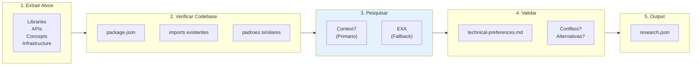

#### Prioridade de Ferramentas

| Ferramenta | Prioridade | Timeout | Uso |
|------------|------------|---------|-----|
| **Context7** | 1 (primaria) | 30s | Documentacao de bibliotecas |
| **EXA** | 2 (fallback) | - | Pesquisa web geral |
| **Codebase** | - | - | Verificar implementacoes existentes |

---

### 3.4 Fase 4: Write Specification

| Atributo | Valor |
|----------|-------|
| **Step ID** | `spec` |
| **Phase Number** | 4 |
| **Agente** | @pm (Morgan) |
| **Task** | `spec-write-spec.md` |
| **Constitutional Gate** | Article IV - No Invention |

#### Inputs

| Input | Tipo | Obrigatorio | Descricao |
|-------|------|-------------|-----------|
| `storyId` | string | Sim | ID da story |
| `requirements` | file | Sim | requirements.json |
| `complexity` | file | Nao | complexity.json |
| `research` | file | Nao | research.json |

#### Outputs

| Output | Localizacao |
|--------|-------------|
| `spec.md` | `docs/stories/{storyId}/spec/spec.md` |

#### Constitutional Gate: No Invention

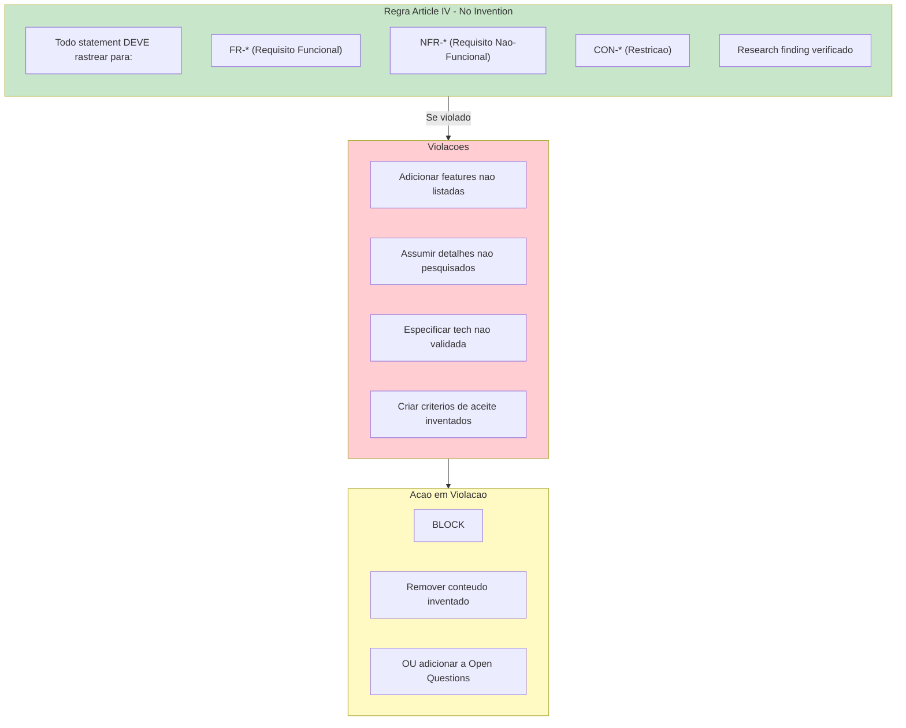

#### Estrutura do spec.md

```
1. Overview
   1.1 Goals
   1.2 Non-Goals
2. Requirements Summary
   2.1 Functional Requirements
   2.2 Non-Functional Requirements
   2.3 Constraints
3. Technical Approach
   3.1 Architecture Overview
   3.2 Component Design
   3.3 Data Flow
4. Dependencies
   4.1 External Dependencies
   4.2 Internal Dependencies
5. Files to Modify/Create
   5.1 New Files
   5.2 Modified Files
6. Testing Strategy
   6.1 Unit Tests
   6.2 Integration Tests
   6.3 Acceptance Tests (Given-When-Then)
7. Risks & Mitigations
8. Open Questions
9. Implementation Checklist
```

---

### 3.5 Fase 5: Critique Specification

| Atributo | Valor |
|----------|-------|
| **Step ID** | `critique` |
| **Phase Number** | 5 |
| **Agente** | @qa (Quinn) |
| **Task** | `spec-critique.md` |
| **Gate** | Blocking (APPROVED/NEEDS_REVISION/BLOCKED) |

#### Inputs

| Input | Tipo | Obrigatorio | Descricao |
|-------|------|-------------|-----------|
| `storyId` | string | Sim | ID da story |
| `spec` | file | Sim | spec.md |
| `requirements` | file | Sim | requirements.json |
| `complexity` | file | Nao | complexity.json |
| `research` | file | Nao | research.json |

#### Outputs

| Output | Localizacao |
|--------|-------------|
| `critique.json` | `docs/stories/{storyId}/spec/critique.json` |

#### 5 Dimensoes de Qualidade

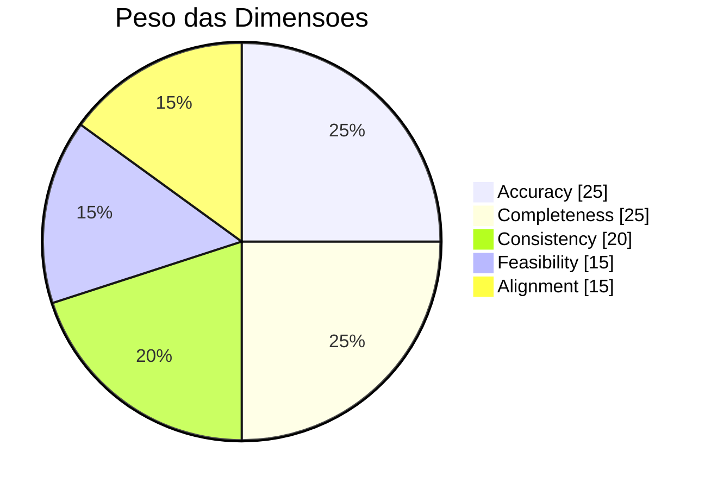

| Dimensao | Peso | Verifica |
|----------|------|----------|
| **Accuracy** | 25% | Spec reflete requisitos corretamente? |
| **Completeness** | 25% | Todas secoes preenchidas? Tests cobrem FRs? |
| **Consistency** | 20% | IDs validos? Sem contradicoes? |
| **Feasibility** | 15% | Tecnicamente possivel? Dependencias existem? |
| **Alignment** | 15% | Alinhado com stack e padroes do projeto? |

#### Logica de Verdict

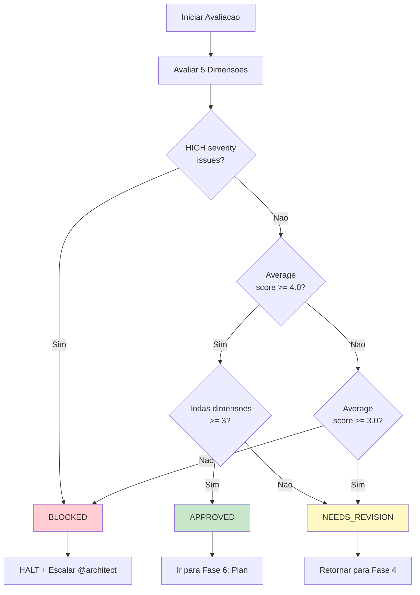

| Verdict | Condicao | Proxima Acao |
|---------|----------|--------------|
| **APPROVED** | No HIGH issues, avg >= 4.0, all >= 3 | Ir para Plan |
| **NEEDS_REVISION** | MEDIUM issues OR avg 3.0-3.9 | Retornar para Spec Write |
| **BLOCKED** | HIGH issues OR avg < 3.0 OR any <= 1 | Escalar para @architect |

---

### 3.6 Fase 5b: Revise Specification

| Atributo | Valor |
|----------|-------|
| **Step ID** | `revise` |
| **Phase Number** | 5b |
| **Agente** | @pm (Morgan) |
| **Condition** | `complexity.result === 'COMPLEX'` OR `critique.verdict === 'NEEDS_REVISION'` |

#### Inputs

| Input | Tipo | Obrigatorio | Descricao |
|-------|------|-------------|-----------|
| `storyId` | string | Sim | ID da story |
| `spec` | file | Sim | spec.md atual |
| `critique` | file | Sim | critique.json com feedback |

#### Outputs

| Output | Localizacao |
|--------|-------------|
| `spec.md` (updated) | `docs/stories/{storyId}/spec/spec.md` |

---

### 3.7 Fase 5c: Second Critique

| Atributo | Valor |
|----------|-------|
| **Step ID** | `critique_2` |
| **Phase Number** | 5c |
| **Agente** | @qa (Quinn) |
| **Task** | `spec-critique.md` |
| **Condition** | `complexity.result === 'COMPLEX'` |

> **Nota:** Segunda critica e mais leniente em issues MEDIUM se houver melhoria demonstrada.

---

### 3.8 Fase 6: Create Implementation Plan

| Atributo | Valor |
|----------|-------|
| **Step ID** | `plan` |
| **Phase Number** | 6 |
| **Agente** | @architect (Aria) |
| **Task** | `plan-create-implementation.md` |
| **Condition** | `critique.verdict === 'APPROVED'` |

#### Inputs

| Input | Tipo | Obrigatorio | Descricao |
|-------|------|-------------|-----------|
| `storyId` | string | Sim | ID da story |
| `spec` | file | Sim | spec.md aprovado |
| `complexity` | file | Nao | complexity.json |

#### Outputs

| Output | Localizacao |
|--------|-------------|
| `plan.json` | `docs/stories/{storyId}/plan/implementation.yaml` |

#### Regras de Subtasks

| Regra | Descricao |
|-------|-----------|
| **Single Service** | 1 servico por subtask (frontend, backend, database, infra) |
| **File Limit** | Maximo 3 arquivos por subtask |
| **Verification Required** | Cada subtask DEVE ter verificacao definida |
| **Dependency Order** | Database > Backend > Frontend > Integration |

---

## 4. Agentes Participantes

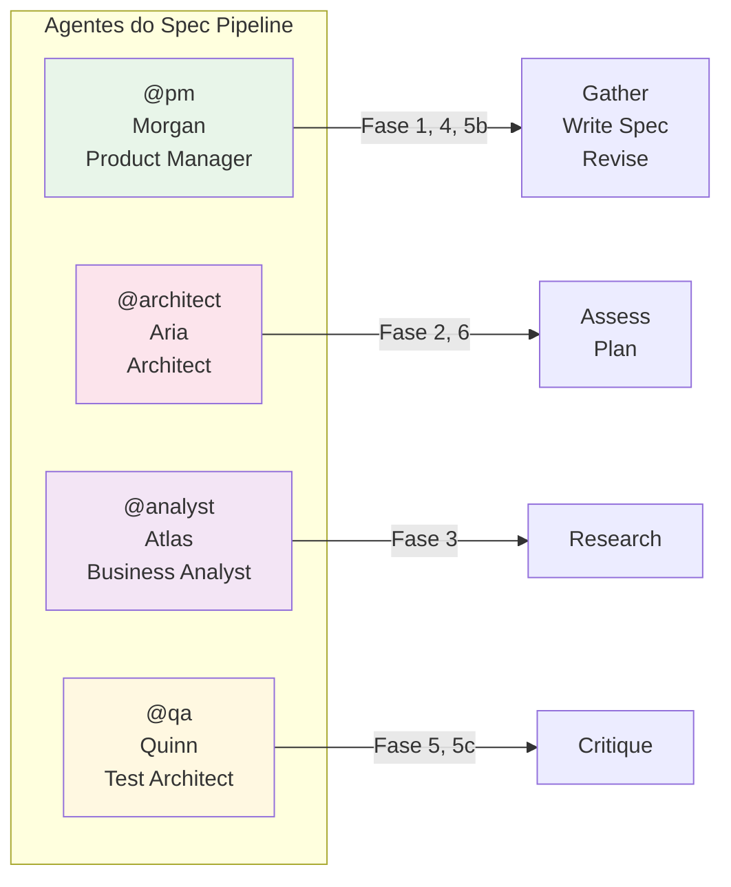

| Agente | ID | Nome | Papel no Pipeline | Fases |
|--------|-----|------|-------------------|-------|
| @pm | pm | Morgan | Product Manager | 1 (Gather), 4 (Spec), 5b (Revise) |
| @architect | architect | Aria | System Architect | 2 (Assess), 6 (Plan) |
| @analyst | analyst | Atlas | Business Analyst | 3 (Research) |
| @qa | qa | Quinn | Test Architect | 5 (Critique), 5c (Critique 2) |

### 4.1 Perfil: @pm (Morgan)

- **Arquetipo:** Strategist
- **Foco:** Coleta de requisitos, criacao de especificacoes, documentacao
- **Principios:** User-focused, data-informed, clarity & precision
- **Ferramentas:** Templates de PRD, elicitacao estruturada

### 4.2 Perfil: @architect (Aria)

- **Arquetipo:** Visionary
- **Foco:** Arquitetura de sistemas, avaliacao tecnica, planejamento
- **Principios:** Holistic thinking, pragmatic selection, security at every layer
- **Ferramentas:** Context7, EXA, analise de codebase

### 4.3 Perfil: @analyst (Atlas)

- **Arquetipo:** Decoder
- **Foco:** Pesquisa, analise de mercado, validacao de dependencias
- **Principios:** Curiosity-driven, evidence-based, action-oriented
- **Ferramentas:** EXA, Context7, Google Workspace

### 4.4 Perfil: @qa (Quinn)

- **Arquetipo:** Guardian
- **Foco:** Validacao de qualidade, gates de aprovacao, rastreabilidade
- **Principios:** Requirements traceability, risk-based testing, advisory excellence
- **Ferramentas:** CodeRabbit, Browser testing, analise de spec

---

## 5. Tasks Executadas

| Task | Fase | Agente | Arquivo |
|------|------|--------|---------|
| Gather Requirements | 1 | @pm | `.aiox-core/development/tasks/spec-gather-requirements.md` |
| Assess Complexity | 2 | @architect | `.aiox-core/development/tasks/spec-assess-complexity.md` |
| Research Dependencies | 3 | @analyst | `.aiox-core/development/tasks/spec-research-dependencies.md` |
| Write Specification | 4 | @pm | `.aiox-core/development/tasks/spec-write-spec.md` |
| Critique Specification | 5, 5c | @qa | `.aiox-core/development/tasks/spec-critique.md` |
| Create Implementation Plan | 6 | @architect | `.aiox-core/development/tasks/plan-create-implementation.md` |

---

## 6. Pre-requisitos

### 6.1 Pre-Flight Checks

| Check | Descricao | Blocking |
|-------|-----------|----------|
| `story_exists` | Diretorio da story existe ou pode ser criado | Sim |
| `no_existing_spec` | Verificar spec existente (evitar sobrescrita) | Nao (warning) |
| `agents_available` | Agentes do pipeline estao configurados | Sim |

### 6.2 Configuracao Necessaria

```yaml
config:
  autoSpec:
    enabled: false        # Ativar auto-spec quando story criada
  showProgress: true      # Mostrar progresso
  verbose: true           # Logs detalhados
  maxRetries: 2           # Tentativas em caso de falha
  retryDelay: 1000        # Delay entre retries (ms)
  strictGate: true        # BLOCKED halts pipeline
  outputDir: docs/stories/{storyId}/spec/
```

---

## 7. Entradas e Saidas

### 7.1 Entradas do Pipeline

| Entrada | Tipo | Descricao | Fornecido Por |
|---------|------|-----------|---------------|
| `storyId` | string | ID unico da story | Usuario |
| `source` | enum | `prd`, `user`, `existing` | Usuario (opcional) |
| `prdPath` | string | Caminho para PRD existente | Usuario (opcional) |
| `overrideComplexity` | enum | Override manual de complexidade | Usuario (opcional) |

### 7.2 Saidas do Pipeline

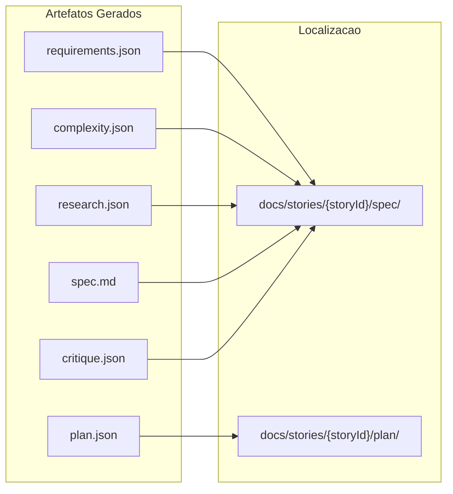

| Artefato | Fase | Descricao |
|----------|------|-----------|
| `requirements.json` | 1 | Requisitos estruturados (9 categorias) |
| `complexity.json` | 2 | Avaliacao de complexidade (5 dimensoes) |
| `research.json` | 3 | Dependencias pesquisadas e validadas |
| `spec.md` | 4 | Especificacao completa executavel |
| `critique.json` | 5 | Resultado da avaliacao de qualidade |
| `plan.json` | 6 | Plano de implementacao com subtasks |

---

## 8. Pontos de Decisao

### 8.1 Decisao: Pular Assess?

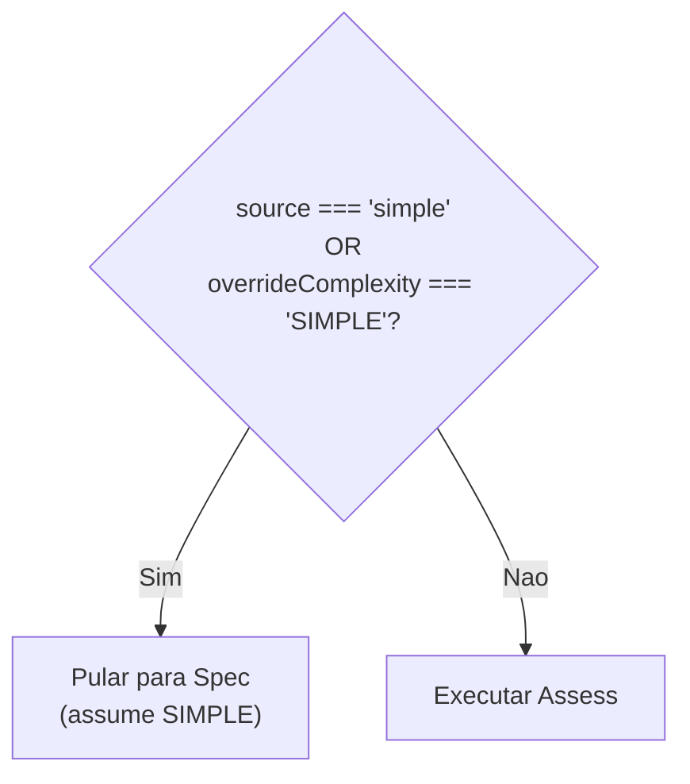

### 8.2 Decisao: Pular Research?

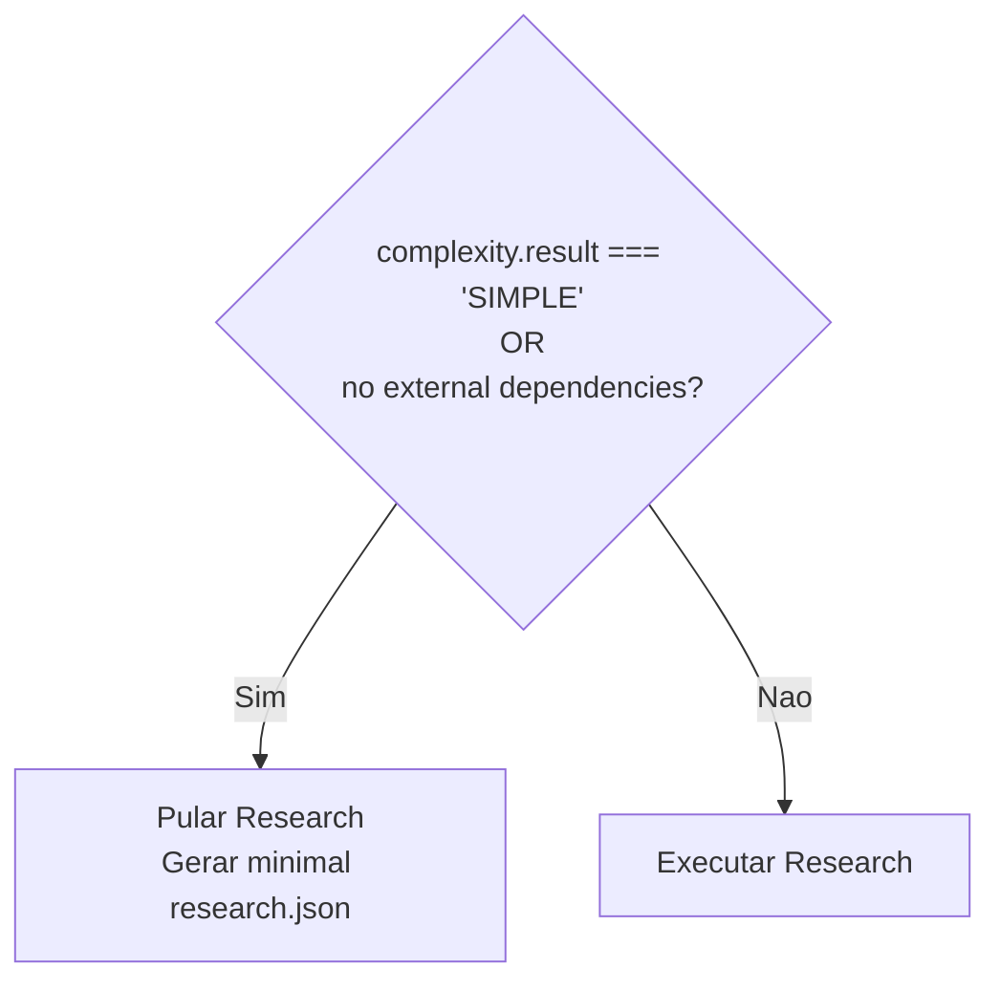

### 8.3 Decisao: Verdict da Critique

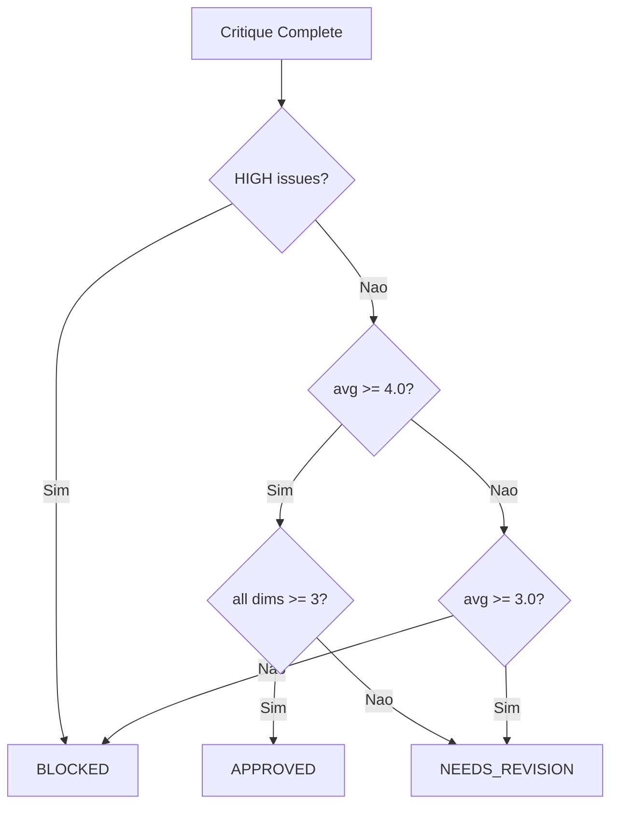

### 8.4 Decisao: Executar Revise?

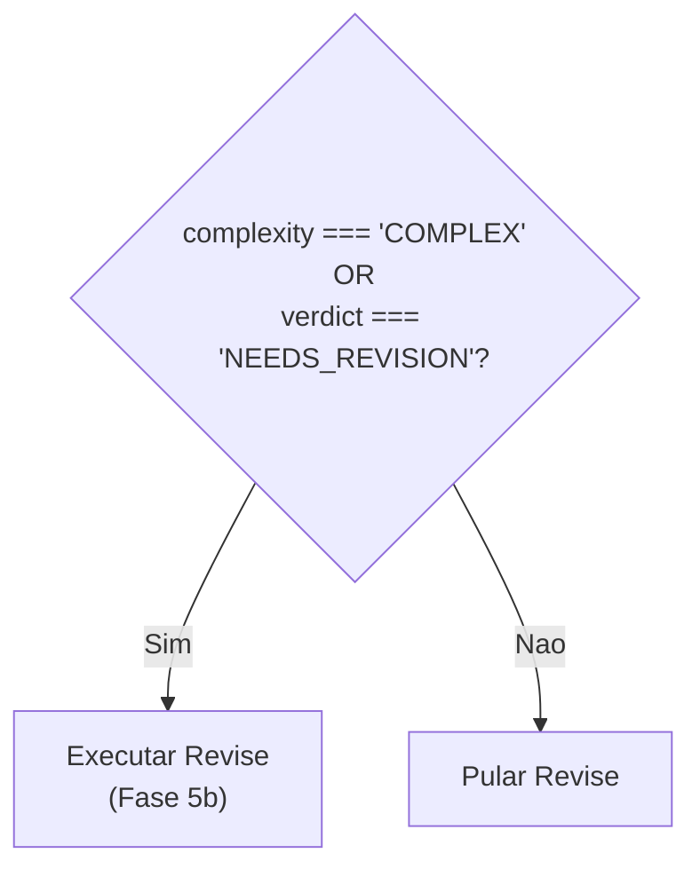

### 8.5 Decisao: Segunda Critique?

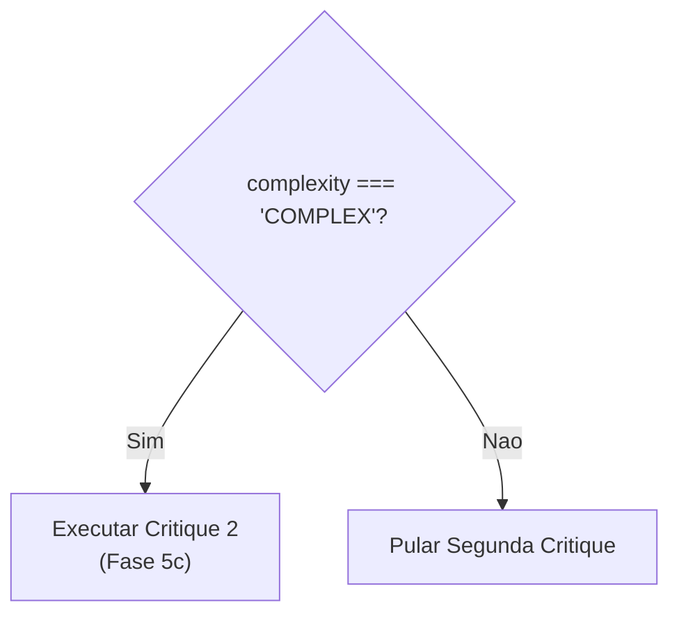

---

## 9. Troubleshooting

### 9.1 Erros Comuns

| Erro | Causa | Solucao |
|------|-------|---------|
| `missing_story_id` | Story ID nao fornecido | `*create-spec STORY-42` |
| `phase_failed` | Fase falhou durante execucao | Verificar logs, usar `--resume` |
| `max_iterations_reached` | Limite de revisoes atingido | Escalr para @architect |
| `critique_blocked` | Spec bloqueado pelo QA gate | Revisar critique.json, corrigir HIGH issues |
| `missing-requirements` | requirements.json nao encontrado | Executar fase Gather primeiro |
| `empty-functional` | Nenhum requisito funcional | Re-executar elicitacao |
| `context7-unavailable` | Context7 MCP nao responde | Usar EXA como fallback |

### 9.2 Como Retomar Execucao

O pipeline suporta retomada atraves de checkpoints:

```yaml
resume:
  enabled: true
  state_file: docs/stories/{storyId}/spec/.pipeline-state.json

  checkpoints:
    - after: gather   -> requirements_gathered
    - after: assess   -> complexity_assessed
    - after: research -> research_complete
    - after: spec     -> spec_written
    - after: critique -> critique_complete
```

**Comando para retomar:**
```bash
*create-spec STORY-42 --resume
```

### 9.3 Arvore de Decisao de Erros

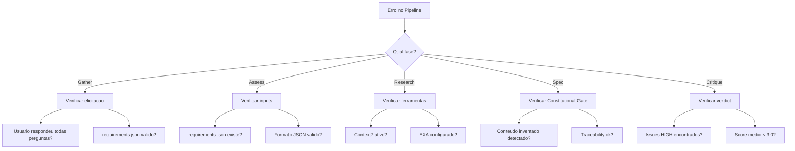

---

## 10. Referencias

### 10.1 Arquivos do Workflow

| Arquivo | Localizacao |
|---------|-------------|
| Definicao do Workflow | `.aiox-core/development/workflows/spec-pipeline.yaml` |
| Task: Gather | `.aiox-core/development/tasks/spec-gather-requirements.md` |
| Task: Assess | `.aiox-core/development/tasks/spec-assess-complexity.md` |
| Task: Research | `.aiox-core/development/tasks/spec-research-dependencies.md` |
| Task: Write Spec | `.aiox-core/development/tasks/spec-write-spec.md` |
| Task: Critique | `.aiox-core/development/tasks/spec-critique.md` |
| Task: Create Plan | `.aiox-core/development/tasks/plan-create-implementation.md` |

### 10.2 Agentes Relacionados

| Agente | Localizacao |
|--------|-------------|
| @pm (Morgan) | `.aiox-core/development/agents/pm.md` |
| @architect (Aria) | `.aiox-core/development/agents/architect.md` |
| @analyst (Atlas) | `.aiox-core/development/agents/analyst.md` |
| @qa (Quinn) | `.aiox-core/development/agents/qa.md` |

### 10.3 Documentacao Relacionada

- [Workflows YAML Guide](../workflows-yaml-guide.md)
- [AIOX Documentation Index](../AIOX-DOCUMENTATION-INDEX.md)
- [Backlog Management System](../BACKLOG-MANAGEMENT-SYSTEM.md)

### 10.4 Commands Rapidos

| Comando | Descricao | Agente |
|---------|-----------|--------|
| `*create-spec STORY-ID` | Executar pipeline completo | - |
| `*gather-requirements STORY-ID` | Apenas fase Gather | @pm |
| `*assess-complexity STORY-ID` | Apenas fase Assess | @architect |
| `*research-deps STORY-ID` | Apenas fase Research | @analyst |
| `*write-spec STORY-ID` | Apenas fase Write | @pm |
| `*critique-spec STORY-ID` | Apenas fase Critique | @qa |

---

## 11. Mensagem de Conclusao

Ao finalizar com sucesso, o pipeline exibe:

```
+==============================================================+
|  Spec Pipeline Complete                                      |
+==============================================================+

Story:       {storyId}
Complexity:  {SIMPLE|STANDARD|COMPLEX}
Verdict:     APPROVED
Score:       {score}/5

Artifacts:
   - docs/stories/{storyId}/spec/requirements.json
   - docs/stories/{storyId}/spec/complexity.json
   - docs/stories/{storyId}/spec/research.json
   - docs/stories/{storyId}/spec/spec.md
   - docs/stories/{storyId}/spec/critique.json

Next Steps:
   - Review spec.md
   - Run @dev *develop {storyId}
```

---

## Metadata

```yaml
metadata:
  documento: SPEC-PIPELINE-WORKFLOW.md
  versao: 1.0
  criado: 2026-02-04
  autor: Technical Documentation Specialist
  baseado_em:
    - .aiox-core/development/workflows/spec-pipeline.yaml
    - .aiox-core/development/tasks/spec-*.md
    - .aiox-core/development/agents/*.md
  tags:
    - spec-pipeline
    - workflow
    - documentacao
    - aiox
    - auto-claude
```
