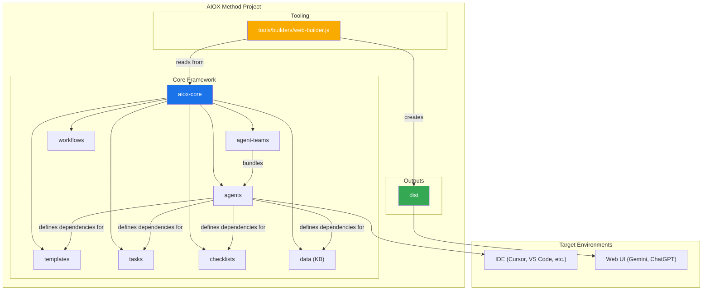
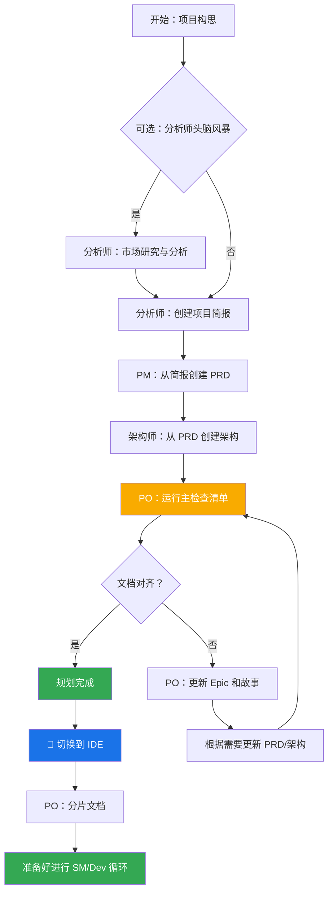
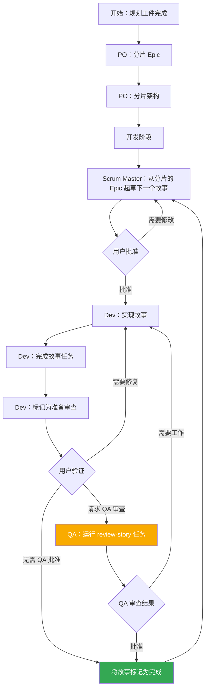

<!--
  翻译：zh-CN（简体中文）
  原文：/docs/core-architecture.md
  最后同步：2026-02-22
-->

# AIOX 方法：核心架构

> 🌐 [EN](../core-architecture.md) | [PT](../pt/core-architecture.md) | [ES](../es/core-architecture.md) | **ZH**

---

## 1. 概述

AIOX 方法旨在提供代理模式、任务和模板，以允许可重复的有用工作流，无论是用于敏捷代理开发，还是扩展到完全不同的领域。该项目的核心目的是提供一组结构化但灵活的提示、模板和工作流，用户可以使用这些来指导 AI 代理（如 Gemini、Claude 或 ChatGPT）以可预测、高质量的方式执行复杂任务、引导讨论或其他有意义的特定领域流程。

系统核心模块促进了针对当前现代 AI 代理工具挑战定制的完整开发生命周期：

1. **构思与规划**：头脑风暴、市场研究和创建项目简报。
2. **架构与设计**：定义系统架构和 UI/UX 规范。
3. **开发执行**：一个循环工作流，其中 Scrum Master（SM）代理起草具有极其具体上下文的故事，开发者（Dev）代理一次实现一个。此流程适用于新项目（绿地项目）和现有项目（棕地项目）。

## 2. 系统架构图

整个 AIOX 方法生态系统围绕已安装的 `aiox-core` 目录设计，该目录充当操作的大脑。`tools` 目录提供了为不同环境处理和打包此大脑的方法。

## 3. 核心组件

`aiox-core` 目录包含赋予代理能力的所有定义和资源。

### 3.1. 代理 (`aiox-core/agents/`)

- **目的**：这些是系统的基础构建块。每个 markdown 文件（例如 `aiox-master.md`、`pm.md`、`dev.md`）定义单个 AI 代理的角色、能力和依赖项。
- **结构**：代理文件包含一个 YAML 头部，指定其角色、角色设定、依赖项和启动指令。这些依赖项是代理被允许使用的任务、模板、检查清单和数据文件列表。
- **启动指令**：代理可以包含启动序列，从 `docs/` 文件夹加载项目特定文档，如编码标准、API 规范或项目结构文档。这在激活时提供即时的项目上下文。
- **文档集成**：代理可以引用和加载项目 `docs/` 文件夹中的文档，作为任务、工作流或启动序列的一部分。用户也可以直接将文档拖入聊天界面以提供额外上下文。
- **示例**：`aiox-master` 代理列出其依赖项，这告诉构建工具要在 web 包中包含哪些文件，并告知代理其自身的能力。

### 3.2. 代理团队 (`aiox-core/agent-teams/`)

- **目的**：团队文件（例如 `team-all.yaml`）定义为特定目的（如"全栈开发"或"仅后端"）捆绑在一起的代理和工作流集合。这为 web UI 环境创建了一个更大的预打包上下文。
- **结构**：团队文件列出要包含的代理。它可以使用通配符，例如 `"*"` 包含所有代理。这允许创建像 `team-all` 这样的综合包。

### 3.3. 工作流 (`aiox-core/workflows/`)

- **目的**：工作流是 YAML 文件（例如 `greenfield-fullstack.yaml`），为特定项目类型定义规定的步骤序列和代理交互。它们充当用户和 `aiox-orchestrator` 代理的战略指南。
- **结构**：工作流为复杂和简单项目定义序列，列出每个步骤涉及的代理、它们创建的工件以及从一个步骤移动到下一个步骤的条件。它通常包含一个用于可视化的 Mermaid 图。

### 3.4. 可重用资源 (`templates`、`tasks`、`checklists`、`data`)

- **目的**：这些文件夹包含代理根据其依赖项动态加载的模块化组件。
  - **`templates/`**：包含常见文档的 markdown 模板，如 PRD、架构规范和用户故事。
  - **`tasks/`**：定义执行特定可重复操作（如"shard-doc"或"create-next-story"）的指令。
  - **`checklists/`**：为产品负责人（`po`）或架构师等代理提供质量保证检查清单。
  - **`data/`**：包含核心知识库（`aiox-kb.md`）、技术偏好（`technical-preferences.md`）和其他关键数据文件。

#### 3.4.1. 模板处理系统

AIOX 的一个关键架构原则是模板是自包含和交互式的——它们嵌入了所需的文档输出和与用户协作所需的 LLM 指令。这意味着在许多情况下，不需要单独的任务来创建文档，因为模板本身包含所有处理逻辑。

AIOX 框架采用由三个关键组件编排的复杂模板处理系统：

- **`template-format.md`** (`aiox-core/utils/`)：定义整个 AIOX 模板中使用的基础标记语言。此规范建立了变量替换（`{{placeholders}}`）、仅 AI 处理指令（`[[LLM: instructions]]`）和条件逻辑块的语法规则。模板遵循此格式以确保整个系统的一致处理。

- **`create-doc.md`** (`aiox-core/tasks/`)：充当管理整个文档生成工作流的编排引擎。此任务协调模板选择、管理用户交互模式（增量与快速生成）、强制执行模板格式处理规则并处理验证。它充当用户和模板系统之间的主要接口。

- **`advanced-elicitation.md`** (`aiox-core/tasks/`)：提供可通过 `[[LLM: instructions]]` 块嵌入模板的交互式细化层。此组件提供 10 种结构化头脑风暴操作、逐节审查功能和迭代改进工作流以提高内容质量。

该系统保持关注点分离：模板标记由 AI 代理内部处理但从不暴露给用户，同时通过模板本身嵌入的智能提供复杂的 AI 处理能力。

#### 3.4.2. 技术偏好系统

AIOX 通过 `aiox-core/data/` 中的 `technical-preferences.md` 文件包含个性化层。此文件作为影响所有项目中代理行为的持久技术配置文件。

**目的和好处：**

- **一致性**：确保所有代理引用相同的技术偏好
- **效率**：消除重复指定首选技术的需要
- **个性化**：代理提供与用户偏好一致的建议
- **学习**：捕获随时间演变的经验教训和偏好

**内容结构：**
该文件通常包括首选技术栈、设计模式、外部服务、编码标准和要避免的反模式。代理在规划和开发期间自动引用此文件以提供上下文适当的建议。

**集成点：**

- 模板可以在文档生成期间引用技术偏好
- 当适合项目需求时，代理建议首选技术
- 当偏好不符合项目需求时，代理解释替代方案
- Web 包可以包含偏好内容以在平台间保持一致行为

**随时间演变：**
鼓励用户使用项目中的发现持续更新此文件，添加积极的偏好和要避免的技术，创建一个随时间改进代理建议的个性化知识库。

## 4. 构建和交付流程

该框架为两个主要环境设计：本地 IDE 和基于 web 的 AI 聊天界面。`web-builder.js` 脚本是支持后者的关键。

### 4.1. Web Builder (`tools/builders/web-builder.js`)

- **目的**：此 Node.js 脚本负责创建 `dist` 中的 `.txt` 包。
- **流程**：
  1. **解析依赖项**：对于给定的代理或团队，脚本读取其定义文件。
  2. 它递归查找代理/团队需要的所有依赖资源（任务、模板等）。
  3. **捆绑内容**：它读取所有这些文件的内容并将它们连接成一个大的文本文件，使用清晰的分隔符指示每个部分的原始文件路径。
  4. **输出包**：最终的 `.txt` 文件保存在 `dist` 目录中，准备上传到 web UI。

### 4.2. 特定环境使用

- **对于 IDE**：用户通过 `aiox-core/agents/` 中的 markdown 文件直接与代理交互。IDE 集成（用于 Cursor、Claude Code 等）知道如何调用这些代理。
- **对于 Web UI**：用户从 `dist` 上传预构建的包。这个单一文件为 AI 提供整个团队及其所有所需工具和知识的上下文。

## 5. AIOX 工作流

### 5.1. 规划工作流

在开发开始之前，AIOX 遵循结构化的规划工作流，为成功的项目执行建立基础：

**关键规划阶段：**

1. **可选分析**：分析师进行市场研究和竞争分析
2. **项目简报**：由分析师或用户创建的基础文档
3. **PRD 创建**：PM 将简报转换为全面的产品需求
4. **架构设计**：架构师基于 PRD 创建技术基础
5. **验证与对齐**：PO 确保所有文档一致且完整
6. **细化**：根据需要更新 Epic、故事和文档
7. **环境过渡**：从 web UI 到 IDE 的关键切换，用于开发工作流
8. **文档准备**：PO 分片大型文档以供开发消费

**工作流编排**：`aiox-orchestrator` 代理使用这些工作流定义来引导用户完成整个过程，确保规划（web UI）和开发（IDE）阶段之间的正确过渡。

### 5.2. 核心开发循环

一旦初始规划和架构阶段完成，项目进入循环开发工作流，如 `aiox-kb.md` 中所述。这确保了稳定、顺序和质量控制的实现过程。

此循环继续，Scrum Master、开发者和可选的 QA 代理协同工作。QA 代理通过 `review-story` 任务提供高级开发者审查能力，提供代码重构、质量改进和知识转移。这确保了高代码质量，同时保持开发速度。
